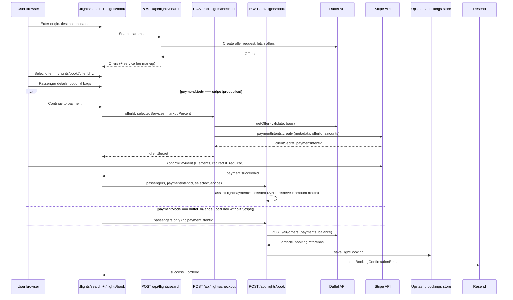

# Flight booking architecture (Skyline Voyager)

This document describes **the architecture as implemented today** in this repository. It is not a greenfield design doc.

**Maintainers:** When you change booking routes, payment verification, webhooks, or Duffel/Stripe integration, update this file in the same PR. Linked from [`README.md`](../README.md#documentation) and [`AGENTS.md`](../AGENTS.md).

**Stack:** Next.js 16 App Router on Vercel · Duffel (flight supplier) · Stripe PaymentIntent (customer payment) · Upstash Redis (bookings + webhook idempotency) · Resend (email).

---

## Current implementation (summary)

| Concern | Implementation |
|--------|----------------|
| Flight inventory & ticketing | Duffel API (`duffel_test_` / `duffel_live_`) |
| Customer payment | **Stripe PaymentIntent** + embedded Elements (`FlightStripeCheckout`) |
| Payment verification before ticket | **Server-side** in `bookFlight()` via `assertFlightPaymentSucceeded()` |
| Agency payment to airline | Duffel **balance** payment on order create (after customer pays Stripe) |
| Booking persistence | Upstash Redis (production) or `data/bookings.jsonl` (local fallback) |
| Confirmation email | Resend |
| Post-booking events | Duffel webhooks → schedule-change emails, idempotency in Upstash |
| Affiliate fallback | `lib/partner-links.ts` (env-driven outbound URLs on hub pages) |

We are **not** using Stripe Checkout Session for flights unless there is a specific business or UX reason to change.

---

## Route map

### Pages (UI)

| Path | File | Role |
|------|------|------|
| `/flights` | `app/flights/page.tsx` | Flights hub |
| `/flights/search` | `app/flights/search/page.tsx` | Search form → calls search API |
| `/flights/book` | `app/flights/book/page.tsx` | Passenger details, bags, Stripe pay, book |
| `/flights/lookup` | `app/flights/lookup/page.tsx` | Find booking by reference + email |
| `/flights/manage` | `app/flights/manage/page.tsx` | Change / cancel (post-booking) |

### API routes (server)

| Method | Path | File | Role |
|--------|------|------|------|
| POST | `/api/flights/search` | `app/api/flights/search/route.ts` | Duffel offer request → priced offers |
| GET | `/api/flights/offer` | `app/api/flights/offer/route.ts` | Refresh single offer |
| GET | `/api/flights/places` | `app/api/flights/places/route.ts` | Airport autocomplete |
| GET | `/api/flights/status` | `app/api/flights/status/route.ts` | Public config (mode, markup, payment mode) |
| POST | `/api/flights/checkout` | `app/api/flights/checkout/route.ts` | Create Stripe PaymentIntent for selected offer |
| POST | `/api/flights/book` | `app/api/flights/book/route.ts` | Verify payment → Duffel order → store → email |
| GET | `/api/flights/lookup` | `app/api/flights/lookup/route.ts` | Lookup stored booking |
| POST | `/api/flights/cancel` | `app/api/flights/cancel/route.ts` | Cancel order (+ Stripe refund when applicable) |
| * | `/api/flights/change/*` | `app/api/flights/change/...` | Order change flow |
| POST | `/api/stripe/webhook` | `app/api/stripe/webhook/route.ts` | Stripe webhook (signature verified) |
| POST | `/api/duffel/webhook` | `app/api/duffel/webhook/route.ts` | Duffel webhook (signature verified) |
| GET | `/api/duffel/webhook/status` | `app/api/duffel/webhook/status/route.ts` | Safe secret diagnostics |
| POST | `/api/admin/duffel-webhook/sync` | `app/api/admin/duffel-webhook/sync/route.ts` | Recreate webhook + store secret in Upstash |

All flight API routes use `export const runtime = "nodejs"`.

### Library modules (core logic)

| Module | Responsibility |
|--------|----------------|
| `lib/duffel/client.ts` | Authenticated Duffel HTTP client |
| `lib/duffel/flight-service.ts` | Search, get offer, **bookFlight** |
| `lib/duffel/pricing.ts` | Markup / repricing |
| `lib/stripe/verify-payment.ts` | **assertFlightPaymentSucceeded** |
| `lib/stripe/server.ts` | Stripe SDK instance |
| `lib/flights/payment-mode.ts` | `stripe` vs `duffel_balance` (local test without Stripe) |
| `lib/flights/ancillaries.ts` | Extra bags, checkout totals |
| `lib/bookings/store.ts` | Persist bookings (Upstash or JSONL) |
| `lib/email/booking-confirmation.ts` | Resend confirmation |
| `lib/duffel/webhook-events.ts` | Handle Duffel event types |
| `lib/partner-links.ts` | Affiliate / fallback outbound links |

---

## End-to-end booking sequence

Example: customer books **SFO → LAX**.

### UI flow detail (`FlightBookingPanel`)

1. User submits the book form.
2. If Stripe is configured and no `paymentIntentId` yet → **POST `/api/flights/checkout`** → show `FlightStripeCheckout` (Elements).
3. After `stripe.confirmPayment` succeeds → **`onStripePaid`** → **POST `/api/flights/book`** with `paymentIntentId`.
4. If Stripe is not configured (test balance mode) → **POST `/api/flights/book`** directly without card payment.

---

## Payment lifecycle

### Two-sided payment model

1. **Customer → Skyline Voyager (Stripe)**  
   Customer pays the marked-up total (fare + optional bags + service fee) via PaymentIntent.

2. **Skyline Voyager → airline (Duffel balance)**  
   After customer payment is verified, `bookFlight()` creates a Duffel order with `payments: [{ type: "balance", amount, currency }]`. The agency Duffel account must be funded in live mode.

### Payment modes (`lib/flights/payment-mode.ts`)

| Mode | When | Customer pays | Duffel order |
|------|------|---------------|--------------|
| `stripe` | `STRIPE_SECRET_KEY` set | Stripe PaymentIntent | Yes, after `assertFlightPaymentSucceeded` |
| `duffel_balance` | Stripe not configured | Nothing (dev/test) | Yes, using Duffel test balance |

Production uses **`stripe`**. Local dev often uses **`duffel_balance`** with `duffel_test_` only.

### Checkout route (`POST /api/flights/checkout`)

- Loads and validates the offer (including selected bag services).
- Computes totals via `computeFlightCheckoutTotals`.
- Creates a PaymentIntent with:
  - `automatic_payment_methods: { enabled: true }`
  - `metadata`: `offerId`, `customerAmount`, `supplierAmount`, `markupPercent`, `selectedServices`, etc.
- Returns `clientSecret` and `paymentIntentId` to the client.

**Secrets never reach the browser** except the publishable key and PaymentIntent client secret.

---

## Payment verification (authoritative path today)

Payment is **verified on the server when booking**, not inferred from the browser alone.

### `assertFlightPaymentSucceeded()` (`lib/stripe/verify-payment.ts`)

Called from `bookFlight()` when `getFlightPaymentMode() === "stripe"`. It:

1. Retrieves the PaymentIntent from Stripe (`paymentIntents.retrieve`).
2. Requires `status === "succeeded"`.
3. Compares charged amount and currency to the expected customer total (fare + bags + markup).
4. Checks `metadata.offerId` matches the offer being booked (when present).

If any check fails → `StripePaymentError` → booking aborts **before** Duffel order create.

### Why this is valid

Stripe documents that webhooks are the reliable source for **async** payment updates. In this **synchronous custom flow**, the client calls `/api/flights/book` only after `confirmPayment` succeeds, and the server **re-fetches** payment state from Stripe before ticketing. That is appropriate for PaymentIntent + embedded checkout.

---

## Webhook usage

### Stripe — `POST /api/stripe/webhook`

**Configured:** yes (requires `STRIPE_WEBHOOK_SECRET`).

**Current behavior:**

- Verifies `stripe-signature` via `stripe.webhooks.constructEvent`.
- Handles `payment_intent.payment_failed` → logs via `reportServerError`.
- Returns `{ ok: true, received: true }` for all verified events.

**Not used today for booking:**

- `payment_intent.succeeded` does **not** trigger Duffel order creation.
- Ticketing remains tied to **POST `/api/flights/book`** after server-side verification.

**Why keep the Stripe webhook anyway:**

- Monitoring failed payments.
- Future **reconciliation**: if `/api/flights/book` fails after a successful charge, a webhook handler could retry booking or alert ops (not implemented yet).

Recommended Stripe Dashboard events: `payment_intent.succeeded`, `payment_intent.payment_failed`.  
Endpoint: `https://skylinevoyager.com/api/stripe/webhook`

### Duffel — `POST /api/duffel/webhook`

**Configured:** yes (requires secret in Vercel env and/or Upstash via auto-sync).

**Purpose:** post-booking airline events, not initial ticketing.

| Event | Handler |
|-------|---------|
| `ping.triggered` | Acknowledge (connectivity test) |
| `order.airline_initiated_change_detected` | Email customer if booking found in store |
| `order.created`, `order.updated`, `air.order.changed` | Logged; no extra action today |
| Other | Logged + idempotency mark |

**Verification:** `X-Duffel-Signature` HMAC (see `lib/duffel/webhook-signature.ts`). Secrets loaded from Vercel `DUFFEL_WEBHOOK_SECRET` and/or Upstash (`sv:config:duffel_webhook_secret`).

**Idempotency:** Upstash keys `sv:duffel:wev:{idempotency_key}` (when Redis configured).

**Admin sync:** `POST /api/admin/duffel-webhook/sync` (auth: `DUFFEL_WEBHOOK_SETUP_KEY`) recreates the Duffel webhook and stores the secret in Upstash.

---

## Booking persistence & email

After a successful Duffel order:

1. **`saveFlightBooking()`** (`lib/bookings/store.ts`) writes a `StoredBooking` record.
   - **Production:** Upstash (`sv:booking:{id}`, index `sv:bookings:index`).
   - **Local:** append to `data/bookings.jsonl`.
2. **`sendBookingConfirmationEmail()`** via Resend (errors logged, booking still succeeds).

Lookup and manage flows read from the same store.

---

## Pricing & markup

- Live service fee: published percent (Upstash / `data/published-flight-markup.json`) with policy bounds in `lib/duffel/pricing.ts`.
- Customer copy: “Prices include our service fee” (`lib/flights/pricing-policy.ts`).
- Owner preview: `/flights/search?owner=OWNER_PRICING_KEY` (server-only key).

---

## Affiliate fallback (hybrid monetization)

Direct booking uses Duffel + Stripe on-site. For routes or traffic you do not fulfill:

- Set `NEXT_PUBLIC_FLIGHTS_AFFILIATE_URL` (or other partner env vars in `.env.example`).
- Hub pages use `partnerUrl("flights")` from `lib/partner-links.ts`.
- Falls back to neutral URLs when unset.

This is **orthogonal** to the Duffel booking funnel.

---

## Environment variables (flights)

See `.env.example` for the full list. Minimum for live direct booking:

| Variable | Role |
|----------|------|
| `DUFFEL_API_TOKEN` | Server-only Duffel access |
| `DUFFEL_MODE` | `test` \| `live` |
| `DUFFEL_VERSION` | API version (default `v2`) |
| `STRIPE_SECRET_KEY` | PaymentIntent create + verify |
| `NEXT_PUBLIC_STRIPE_PUBLISHABLE_KEY` | Elements in browser |
| `STRIPE_WEBHOOK_SECRET` | Stripe webhook signature |
| `UPSTASH_REDIS_REST_URL` / `UPSTASH_REDIS_REST_TOKEN` | Bookings + Duffel webhook dedupe |
| `DUFFEL_WEBHOOK_SECRET` or Upstash sync | Duffel webhook verification |
| `RESEND_API_KEY` | Confirmation email |

After changing env vars on Vercel, **redeploy** Production so routes pick up new values.

---

## Security notes

- Duffel and Stripe **secret** keys are server-only (never `NEXT_PUBLIC_*`).
- All Duffel and Stripe booking calls go through **`app/api/**` route handlers**.
- Rate limiting on search, checkout, and book (`lib/api/rate-limit.ts`).
- Payment amount and offer id are re-validated server-side before Duffel ticketing.

---

## Possible future alternative: Stripe Checkout Session

**Not implemented.** Documented here only for comparison.

| Aspect | Current (PaymentIntent) | Alternative (Checkout Session) |
|--------|-------------------------|--------------------------------|
| UX | Embedded Elements on `/flights/book` | Redirect or embedded Checkout |
| Create payment | `POST /api/flights/checkout` → `paymentIntents.create` | New route → `checkout.sessions.create` |
| Confirm booking | `POST /api/flights/book` after client pay + `assertFlightPaymentSucceeded` | Often `checkout.session.completed` webhook → then Duffel book |
| When to consider | — | Strong need for hosted checkout, tax/invoicing, or minimal custom pay UI |

Switching would require new routes, UI changes, and webhook handlers. **No migration is planned** unless product requirements change.

---

## Possible future enhancement: webhook reconciliation

If `/api/flights/book` fails after Stripe reports success (network, Duffel timeout):

- Handle `payment_intent.succeeded` in `/api/stripe/webhook`.
- Store pending booking state in Upstash keyed by `paymentIntentId`.
- Retry Duffel order creation idempotently or alert operations.

This would **complement** (not replace) server-side verification on book. Not implemented today.

---

## Related docs

- `.env.example` — env var templates and webhook URLs  
- `README.md` — clone, run, deploy  
- Duffel: [Receiving webhooks](https://duffel.com/docs/guides/receiving-webhooks)  
- Stripe: [PaymentIntents](https://docs.stripe.com/payments/payment-intents), [webhooks](https://docs.stripe.com/webhooks)
